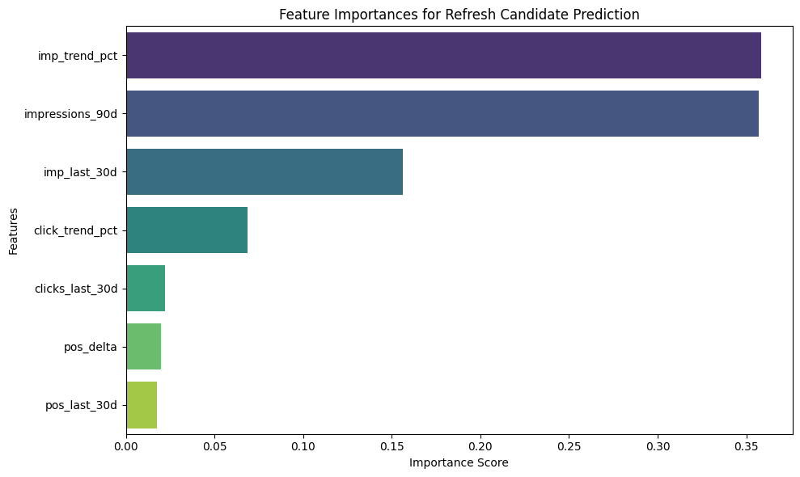
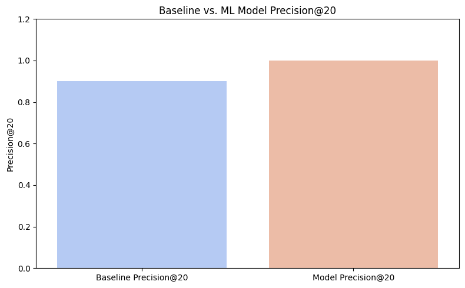

# Capstone Report — Refresh / Content Opportunity Scoring

- **Author:** Uns Ahmad
- **Lane:** Lane 2 (Refresh / Content Opportunity Scoring)
- **Repo:** https://github.com/DEATHVIPERX/FLYRANK-INTERN
- **Date:** August 9, 2026

## Abstract

Content performance can decline over time, making it difficult for content teams to determine which pages should be reviewed or refreshed first. This project develops a machine-learning-based ranking system that identifies content showing significant deterioration in organic search performance and prioritizes the pages most likely to meet a predefined refresh criterion. Using the FlyRank internship warehouse, 271,046 content-level observations were constructed from a 90-day performance window, with recent and previous 30-day periods compared to derive performance trends. A Random Forest classifier was trained using a client-grouped 80/20 split to reduce the risk of information leakage between related pages. The resulting model achieved 100% Precision@20 on the held-out test set, compared with 40% for the rule-based baseline and a 32.40% test-set base rate. The resulting ranked queue is intended to support content strategists by directing attention toward a small number of high-priority refresh candidates rather than requiring manual review of the entire content portfolio.

---

## 1. Introduction

Content teams often manage large numbers of pages whose organic search performance changes over time. When a page begins to lose visibility, identifying it early can provide an opportunity to review and refresh the content before the decline becomes more significant.

The practical problem is therefore not simply identifying whether a page is performing poorly. The more useful question is:

> **Which pages should a content strategist review first?**

A rule-based approach can identify pages experiencing deterioration, but it may produce a large candidate set and does not provide a confidence-ranked queue. This project explores whether a machine-learning model can improve the prioritization of refresh candidates using historical search-performance signals.

The objective is to produce an actionable ranking rather than a generic classification system. A high-performing system should therefore place genuine refresh candidates near the top of the queue, where a content strategist is most likely to begin their work.

## 2. Research Question

The research question for this project is:

> **Can historical organic-search performance signals be used to rank content pages according to their likelihood of meeting a predefined refresh-candidate criterion?**

The decision supported by the model is the prioritization of content-refresh work. Instead of asking a strategist to manually inspect a large content portfolio, the system produces a ranked list of pages that can be reviewed from highest priority downward.

---

## 3. Data

The analysis uses the `FlyRank/internship-warehouse` dataset hosted on Hugging Face. Two tables were used:

- `fact_content_daily_performance`, containing daily content-level performance measurements such as Google Search Console impressions, clicks, and average position.
- `dim_clients.parquet`, containing client-level information and access metadata.

The analysis uses a 90-day rolling window ending at the latest available report date. Content with zero impressions across the 90-day period was excluded because these pages were treated as inactive for the purpose of refresh prioritization.

The resulting analytical dataset contained **271,046 content-level observations and 14 columns**. Each observation represents a content/client combination with aggregated performance measures and derived trend variables.

### 3.1 Performance Windows

The 90-day period was divided into three conceptual components:

- **90-day total impressions**, representing historical search visibility.
- **Most recent 30 days**, representing current performance.
- **Previous 30 days**, representing the comparison period.

The comparison between the two 30-day periods provides a measure of recent deterioration or improvement.

### 3.2 Target Definition

A page was labelled as a refresh candidate when both conditions were satisfied:

1. Its impressions during the latest 30-day period were more than **20% lower** than during the previous 30-day period.
2. Its total impressions over the 90-day period exceeded **500**.

This definition intentionally combines deterioration with a minimum level of historical visibility. A page with very little search activity may fluctuate substantially without representing a useful refresh opportunity.

The resulting label is therefore an **operational definition of a refresh candidate**, rather than a claim that the page is objectively poor or that refreshing it will necessarily recover traffic.

---

## 4. Methodology

### 4.1 Feature Engineering

The model uses recent performance and trend signals derived from the aggregated data.

The principal features include:

- 90-day impressions
- impressions during the latest 30 days
- clicks during the latest 30 days
- average search position during the latest 30 days
- impressions during the previous 30 days
- clicks during the previous 30 days
- average search position during the previous 30 days

Additional indicators were derived from these measurements:

- **Impression trend percentage**, measuring the relative change in impressions between the two 30-day periods.
- **Click trend percentage**, measuring the relative change in clicks.
- **Position delta**, measuring the change in average search position.

These variables allow the model to distinguish between different forms of deterioration, such as falling impressions, falling clicks, or worsening search position.

### 4.2 Baseline

The machine-learning model was compared against a simple rule-based baseline.

The baseline flags a page when:

- 90-day impressions are at least 500, and
- current 30-day impressions are lower than previous 30-day impressions.

This provides a practical benchmark for determining whether the machine-learning ranking adds value beyond a straightforward heuristic.

### 4.3 Train/Test Split

A standard random row-level split could allow pages belonging to the same client to appear in both training and test data. Because pages from the same client can share characteristics and traffic patterns, this could make the model appear stronger than it would be on unseen clients.

To reduce this risk, the dataset was split by `client_hash_id`.

The resulting dataset contained:

| Dataset | Observations |
|---|---:|
| Training | 221,203 |
| Test | 49,843 |
| **Total** | **271,046** |

The split therefore evaluates the model using client groups that were kept separate between training and testing.

### 4.4 Model

A Random Forest classifier was used as the predictive model.

The configuration was:

| Parameter | Value |
|---|---:|
| Number of trees | 100 |
| Maximum depth | 5 |
| Random seed | 42 |

The model produces a probability for each test observation representing its estimated likelihood of belonging to the refresh-candidate class. Pages are then sorted by this probability to create the final recommendation queue.

---

## 5. Results

### 5.1 Evaluation Metric

Because the intended application is a prioritization queue, overall classification accuracy is not the primary evaluation criterion.

Instead, the project uses **Precision@20**.

Precision@20 measures the proportion of genuine refresh candidates among the first 20 pages in the ranked recommendation queue. This reflects the practical situation in which a content strategist may only have time to investigate a small number of recommendations.

The model was evaluated against the baseline using the same held-out test set.

### 5.2 Model Performance

The results were:

| Evaluation | Precision@20 |
|---|---:|
| Test-set base rate | 32.40% |
| Rule-based baseline | 40.00% |
| **Random Forest model** | **100.00%** |

The Random Forest therefore identified a refresh candidate in **all 20 of its highest-ranked test-set recommendations**, compared with 8 out of 20 for the baseline.

Relative to the baseline, this represents an improvement of **60 percentage points** in Precision@20.

> **Important interpretation:** 100% Precision@20 does not mean that the model is 100% accurate across the entire dataset. It means that all 20 of the model's highest-ranked test-set recommendations satisfied the project's predefined refresh-candidate criterion.

### 5.3 Feature Importance

The feature-importance analysis provides an additional view into how the Random Forest distinguishes refresh candidates.

*Figure 1. Relative feature importance from the trained Random Forest classifier.*

The importance analysis helps explain which performance signals contribute most strongly to the model's decisions. The model is primarily designed around observable search-performance signals rather than client identity or arbitrary identifiers.

Feature importance should not be interpreted as causal evidence. A highly important feature indicates that the model uses the feature strongly when making predictions; it does not demonstrate that changing that feature would cause the target outcome to change.

### 5.4 Baseline Comparison

*Figure 2. Precision@20 comparison between the rule-based baseline and the Random Forest model on the same held-out test set.*

The comparison demonstrates the practical value of ranking rather than simply flagging pages. The baseline identifies pages experiencing some degree of decline, while the model uses multiple performance signals to order candidates and concentrate the strongest candidates at the top of the queue.

---

## 6. Ranked Recommendations

The final system converts model predictions into a ranked refresh queue.

Each recommendation contains:

- anonymized content identifier
- anonymized client identifier
- model refresh probability
- reason code
- impression trend
- search-position change

The reason-code layer provides a simple explanation for why a page may deserve attention. Example reason codes include:

- `SEVERE_POSITION_DROP`
- `SEVERE_CLICK_DECAY`
- `TRAFFIC_DECAY`

The final output contains the top 100 recommendations ranked by model confidence. The ten highest-ranked recommendations are shown below.

| Rank | Content ID | Client ID | ML Probability | Reason Code | Impression Trend | Position Delta |
|---:|---|---|---:|---|---:|---:|
| 1 | `content_651c3aefac082aea` | `client_e547b89c05043229` | 0.976340 | SEVERE_POSITION_DROP | -82.86% | 24.31 |
| 2 | `content_4ae34f8ceb6f902c` | `client_23a62021009f63c4` | 0.976313 | SEVERE_POSITION_DROP | -68.79% | 3.25 |
| 3 | `content_5a24bc650fa4f213` | `client_e547b89c05043229` | 0.976313 | SEVERE_POSITION_DROP | -67.87% | 15.39 |
| 4 | `content_f67db8029f4ba7f6` | `client_e547b89c05043229` | 0.976145 | SEVERE_POSITION_DROP | -93.85% | 3.58 |
| 5 | `content_26297fe1cca492ce` | `client_fef1a8f436438636` | 0.975935 | SEVERE_POSITION_DROP | -44.51% | 7.02 |
| 6 | `content_a1da1aef2bc104b9` | `client_fef1a8f436438636` | 0.975935 | SEVERE_POSITION_DROP | -51.81% | 16.14 |
| 7 | `content_da96a0d40210a744` | `client_fef1a8f436438636` | 0.975931 | SEVERE_POSITION_DROP | -52.26% | 13.87 |
| 8 | `content_677d7656e45147d7` | `client_fef1a8f436438636` | 0.975885 | SEVERE_POSITION_DROP | -82.62% | 9.65 |
| 9 | `content_fac1f43da84bccfe` | `client_23a62021009f63c4` | 0.975872 | SEVERE_POSITION_DROP | -68.53% | 5.09 |
| 10 | `content_7c6f1acbc43b31b0` | `client_fef1a8f436438636` | 0.975872 | SEVERE_POSITION_DROP | -62.22% | 3.01 |

The highest-ranked pages show substantial declines in impressions while also exhibiting worsening search-position signals. For example, the highest-ranked recommendation experienced an impression decline of approximately **83%** alongside a position delta of **24.31**.

This output changes the model from a purely predictive exercise into a workflow tool. A content strategist can begin with the highest-ranked pages and use the associated reason codes and performance trends as supporting context when deciding whether a refresh is appropriate.

---

## 7. Limitations

### 7.1 Limited Feature Set

The current model relies primarily on search-performance measurements. It does not incorporate richer content-level information such as topic, content age, word count, publication date, or last-update date.

Adding these variables could allow the system to distinguish between different types of content deterioration and potentially improve prioritization.

### 7.2 Binary Target Definition

The refresh-candidate label is binary. A page either meets the defined criteria or it does not.

In practice, refresh urgency may exist on a spectrum. A future version could use a continuous score or multiple urgency categories rather than a binary label.

### 7.3 Correlation Is Not Causation

The model identifies patterns associated with performance deterioration; it does not establish why a page declined.

Search performance can be influenced by factors outside the current feature set, including seasonality, competitors, changes in search behaviour, or changes to search-engine ranking systems.

Consequently, a high model score should be interpreted as a **review recommendation**, not proof that refreshing the page will restore its previous performance.

### 7.4 Threshold Selection

The >20% impression-decline and >500-impression thresholds are operational choices used to define the project's target. Different thresholds could produce a different target distribution and potentially different model performance.

### 7.5 No Causal or Experimental Validation

The project evaluates whether the model can identify pages satisfying the predefined refresh criterion. It does not test whether refreshing those pages actually improves organic performance.

A future stage should therefore evaluate recommendations through a controlled experiment or longitudinal analysis of pages before and after refresh.

---

## 8. Recommendations

### 8.1 Use the Model as a Prioritization Layer

The model should be used to prioritize human review rather than automatically triggering content changes. A high model probability indicates that a page deserves attention, not that a refresh is guaranteed to improve performance.

### 8.2 Retain the Reason Codes

The reason-code system makes the ranking more actionable by showing whether a recommendation is associated with traffic decline, click decay, or a significant position change.

### 8.3 Expand the Feature Set

Future versions could incorporate:

- content age
- publication date
- last-update date
- topic/category
- content length
- historical refresh activity
- additional search-performance signals

These variables could provide more context about why a page is deteriorating.

### 8.4 Evaluate Recommendations Longitudinally

The strongest next step would be to track what happens after high-ranked pages are refreshed. This would help determine whether model recommendations are associated with measurable recovery in impressions, clicks, and search position.

### 8.5 Revisit the Target Definition

As the workflow matures, the binary refresh-candidate label could be replaced or supplemented with a more granular urgency score. This could distinguish between pages requiring immediate attention and pages that are simply worth monitoring.

---

## 9. Reproducibility

The analysis was implemented in a Jupyter/Colab notebook using Python, DuckDB, pandas, scikit-learn, matplotlib, and seaborn.

The notebook:

1. Retrieves the FlyRank internship warehouse.
2. Constructs the analytical dataset.
3. Performs feature engineering.
4. Separates clients into training and test groups.
5. Trains the Random Forest model.
6. Evaluates Precision@20.
7. Generates the ranked recommendation queue.

### Project Resources

- [GitHub repository](https://github.com/DEATHVIPERX/FLYRANK-INTERN)
- [Capstone notebook](https://github.com/DEATHVIPERX/FLYRANK-INTERN/blob/main/work/notebooks/capstone.ipynb)

The analysis uses anonymized identifiers and does not expose private client names, addresses, search queries, or other identifying information.

---

## 10. Acknowledgments and Data Credit

This project was completed as part of the **FlyRank internship**.

The analysis uses the `FlyRank/internship-warehouse` dataset provided for the internship analysis.

The project follows the privacy requirements of the internship dataset by working with anonymized client and content identifiers.

---

## Conclusion

This project demonstrates a practical approach to prioritizing content-refresh opportunities using historical organic-search performance.

Rather than attempting to predict an abstract measure of content quality, the system defines a concrete refresh-candidate criterion and evaluates whether machine learning can concentrate those candidates at the top of a limited review queue.

On the held-out client-grouped test set, the Random Forest achieved **100% Precision@20**, compared with **40% for the rule-based baseline** and a **32.40% candidate base rate**. This indicates strong top-of-queue performance within the project's defined evaluation framework.
